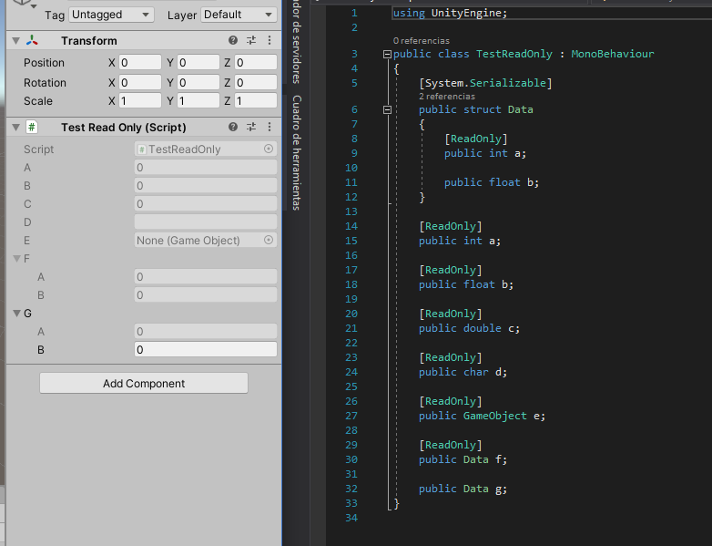
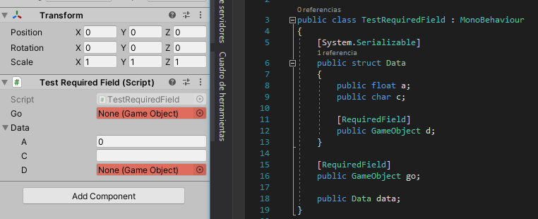
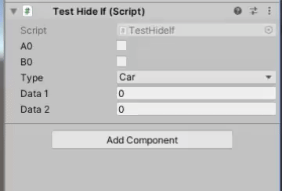
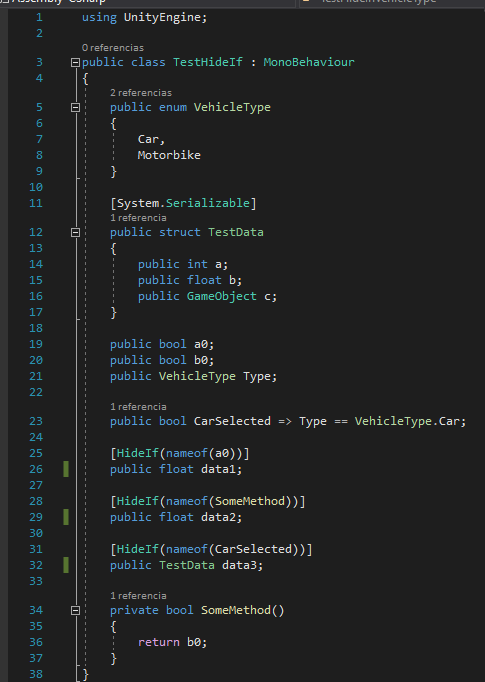
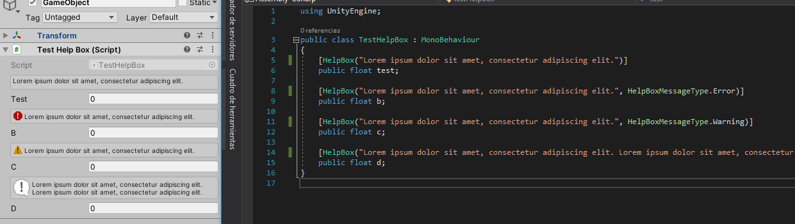

# unity-custom-attributes
Custom attributes to make Unity inspector better!

# How to install
== WIP ==

# Current Attributes
### [ReadOnly]

### [RequiredField]

### [HideIf(string memberName, bool invert)]

### [HelpBox(string message, HelpBoxMessageType messageType)]

### [OnValueChanged(string methodName)]
Custom attribute to call a function when the value is changed on Inspector. (This doesn't work if the value is changed through script)

### [DefaultAssetDatabaseInstance]
If the field is null, the field will be populated with the first result of AssetDatabase.FindAssets<>
Can be useful combined with ScriptableObjects, you can populate an array automatically with the instance of a specific SO.

### [DefaultGetComponent]
If the field is null, the field will be populated with the first result of GetComponent<>

### [DefaultGetComponentInChildren]
If the field is null, the field will be populated with the first result of GetComponentInChildren<>

### [DefaultGetComponentInParent]
If the field is null, the field will be populated with the first result of GetComponentInParent<>

### [DefaultFindObject]
If the field is null, the field will be populated with the first result of FindObjectOfType<>

# Planned Attributes
- [x] **ReadOnly**
- [x] **RequiredField**
- [x] **ShowIf**
- [x] **HideIf(string memberName, bool invert):** Hide field if bool result of memberName is true
- [x] **HelpBox(string message, HelpBoxMessageType messageType)**
- [x] **OnValueChanged(string memberName):** Call function when value is changed (Can be useful for validation)
- [x] **DefaultAssetDatabaseInstance**
- [x] **DefaultGetComponent**
- [x] **DefaultGetComponentInChildren**
- [x] **DefaultGetComponentInParent**
- [x] **DefaultFindObject**
- [ ] **EnableIf:** ReadOnly when boolean is false
- [ ] **DisableIf:** ReadOnly when boolean is true
- [ ] **SceneEnum:** Easy way to assign a scene name to a string (Using dropdown)
- [ ] **Button**
